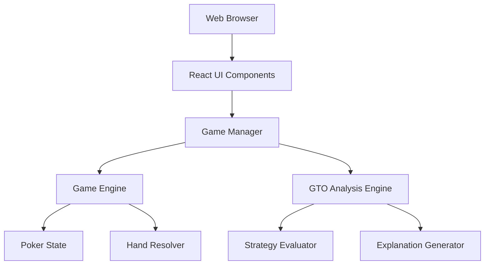
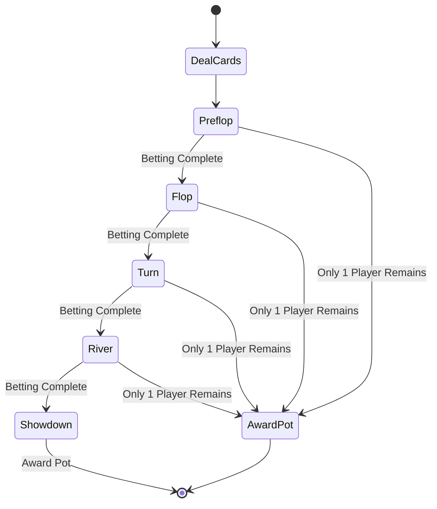

# Design Document: Texas Hold'em Trainer

## Overview

The Texas Hold'em Trainer is a **web-based** educational poker application that simulates an 8-person cash game while providing real-time feedback on optimal play through GTO (Game Theory Optimal) solutions. The system combines a realistic poker game engine with an educational layer that helps players understand the mathematical and strategic reasoning behind correct decisions.

The application is built using TypeScript and runs entirely in the browser, with a React-based UI for rendering the poker table and game state. The architecture follows a turn-based model where each player action triggers a cycle of: action execution → game state update → GTO analysis → educational feedback. This design ensures players receive immediate, contextual learning opportunities at every decision point.

## Technology Stack

- **Frontend Framework**: React with TypeScript
- **State Management**: React Context API or Redux (for game state)
- **Styling**: CSS Modules or Tailwind CSS for responsive design
- **Build Tool**: Vite or Create React App
- **Testing**: Jest + React Testing Library + fast-check (property-based testing)
- **Deployment**: Vercel, Netlify, or AWS S3 + CloudFront
- **Game Logic**: Pure TypeScript classes (already implemented)

## Architecture

The system is organized into five main layers, with the web UI layer added:



### Layer Responsibilities

1. **Web Browser**: Hosts the application, handles rendering and user interactions
2. **React UI Components**: Renders poker table, cards, buttons, and GTO feedback panels
3. **Game Manager**: Orchestrates game flow, coordinates between game engine and GTO analysis
4. **Game Engine**: Implements poker rules, manages game state, and executes actions
5. **GTO Analysis Engine**: Calculates optimal strategies and generates explanations
6. **Poker State**: Maintains complete game state including stacks, pots, cards, and betting history

## Components and Interfaces

### GameManager

The central coordinator that manages the game loop and educational feedback cycle.

```
interface GameManager {
  startNewHand(): void
  processPlayerAction(action: Action): ActionResult
  processAITurn(): void
  getCurrentGameState(): GameState
  getGTOAnalysis(decisionPoint: DecisionPoint): GTOSolution
}
```

**Responsibilities:**
- Initialize and manage game sessions
- Coordinate between game engine and GTO engine
- Trigger GTO analysis after player actions
- Manage hand progression and betting rounds

### GameEngine

Implements core poker game logic and rules enforcement.

```
interface GameEngine {
  dealHand(): void
  executeAction(playerId: string, action: Action): ActionResult
  advanceBettingRound(): void
  resolveHand(): HandResult
  validateAction(playerId: string, action: Action): ValidationResult
  getCurrentBettingRound(): BettingRound
  getActivePlayers(): Player[]
}
```

**Responsibilities:**
- Deal cards and manage deck
- Execute and validate player actions
- Track betting rounds and pot management
- Determine hand winners and distribute pots
- Enforce poker rules (betting limits, action order, etc.)

### PokerState

Maintains the complete state of the poker game.

```
interface PokerState {
  players: Player[]
  communityCards: Card[]
  pots: Pot[]
  dealerPosition: number
  currentBettingRound: BettingRound
  currentBet: number
  actionHistory: ActionRecord[]
  
  updatePlayerStack(playerId: string, amount: number): void
  addToPot(amount: number): void
  createSidePot(): void
  getPlayerByPosition(position: number): Player
}

interface Player {
  id: string
  name: string
  stack: number
  holeCards: Card[]
  position: number
  currentBet: number
  hasFolded: boolean
  isAllIn: boolean
  isAI: boolean
}

interface Pot {
  amount: number
  eligiblePlayers: string[]
  isMainPot: boolean
}

interface Card {
  rank: Rank  // 2-10, J, Q, K, A
  suit: Suit  // Hearts, Diamonds, Clubs, Spades
}

enum BettingRound {
  PREFLOP,
  FLOP,
  TURN,
  RIVER
}

interface Action {
  type: ActionType
  amount?: number  // For bets and raises
}

enum ActionType {
  FOLD,
  CHECK,
  CALL,
  BET,
  RAISE,
  ALL_IN
}
```

### GTOEngine

Calculates optimal strategies and generates educational explanations.

```
interface GTOEngine {
  calculateOptimalStrategy(decisionPoint: DecisionPoint): GTOSolution
  generateExplanation(solution: GTOSolution, context: GameContext): string
  comparePlayerAction(playerAction: Action, gtoSolution: GTOSolution): Comparison
}

interface DecisionPoint {
  gameState: GameState
  playerId: string
  availableActions: Action[]
  potSize: number
  effectiveStack: number
  position: number
  bettingHistory: ActionRecord[]
}

interface GTOSolution {
  actionFrequencies: Map<ActionType, number>  // e.g., {FOLD: 0.3, CALL: 0.5, RAISE: 0.2}
  recommendedAction: ActionType
  expectedValue: number
  strategicReasoning: StrategyFactors
}

interface StrategyFactors {
  potOdds: number
  equity: number
  positionAdvantage: boolean
  rangeAdvantage: string
  boardTexture: string
  stackDepth: number
}

interface Comparison {
  isOptimal: boolean
  deviation: number  // How far from GTO (0-1 scale)
  feedback: string
}
```

### HandResolver

Evaluates poker hands and determines winners.

```
interface HandResolver {
  evaluateHand(holeCards: Card[], communityCards: Card[]): HandRank
  compareHands(hand1: HandRank, hand2: HandRank): number
  determineWinners(players: Player[], communityCards: Card[]): WinnerResult[]
  distributePots(winners: WinnerResult[], pots: Pot[]): Distribution[]
}

interface HandRank {
  category: HandCategory  // High card, pair, two pair, etc.
  value: number  // Numeric value for comparison
  kickers: number[]
}

enum HandCategory {
  HIGH_CARD,
  PAIR,
  TWO_PAIR,
  THREE_OF_A_KIND,
  STRAIGHT,
  FLUSH,
  FULL_HOUSE,
  FOUR_OF_A_KIND,
  STRAIGHT_FLUSH,
  ROYAL_FLUSH
}

interface WinnerResult {
  playerId: string
  handRank: HandRank
  potShare: number
}
```

### AIPlayer

Implements AI opponent decision-making.

```
interface AIPlayer {
  decideAction(gameState: GameState, playerId: string): Action
  getStrategy(): AIStrategy
}

enum AIStrategy {
  TIGHT_AGGRESSIVE,
  LOOSE_AGGRESSIVE,
  TIGHT_PASSIVE,
  LOOSE_PASSIVE,
  BALANCED
}
```

**AI Implementation Notes:**
- AI opponents should use simplified but reasonable poker strategy
- Mix of playing styles to create realistic table dynamics
- Decision-making should complete within 2 seconds
- AI does not need to be GTO-perfect, just competent enough for training

## Data Models

### Game State Snapshot

The complete state at any point in time:

```
interface GameState {
  handNumber: number
  dealerPosition: number
  smallBlindPosition: number
  bigBlindPosition: number
  players: Player[]
  communityCards: Card[]
  pots: Pot[]
  currentBettingRound: BettingRound
  currentBet: number
  minimumRaise: number
  actionQueue: string[]  // Player IDs in action order
  currentActorIndex: number
}
```

### Action Record

Historical record of all actions taken:

```
interface ActionRecord {
  handNumber: number
  bettingRound: BettingRound
  playerId: string
  action: Action
  timestamp: number
  potSizeAfter: number
  stackAfter: number
}
```

### Session Data

Tracks player progress across multiple hands:

```
interface SessionData {
  sessionId: string
  startTime: number
  handsPlayed: number
  playerStats: PlayerStats
  gtoAccuracy: number  // Percentage of decisions matching GTO
}

interface PlayerStats {
  handsWon: number
  totalProfit: number
  vpip: number  // Voluntarily put money in pot percentage
  pfr: number   // Preflop raise percentage
  aggression: number
}
```

## Game Flow

### Hand Lifecycle



### Action Processing Flow

1. **Player Input**: Player selects an action (fold, check, call, raise, all-in)
2. **Validation**: GameEngine validates the action is legal
3. **Execution**: GameEngine updates game state with the action
4. **GTO Analysis**: GTOEngine calculates optimal strategy for that decision point
5. **Feedback Display**: UI shows GTO solution and explanation
6. **Continue**: Game proceeds to next player or next betting round

### Betting Round Completion

A betting round is complete when:
- All active players have acted at least once
- All active players have either folded or matched the current bet
- Only one player remains (all others folded)

### Pot Distribution Algorithm

```
function distributePots(winners: WinnerResult[], pots: Pot[]): Distribution[] {
  distributions = []
  
  for each pot in pots:
    eligibleWinners = winners.filter(w => pot.eligiblePlayers.includes(w.playerId))
    
    if eligibleWinners.length == 1:
      distributions.push({playerId: eligibleWinners[0].playerId, amount: pot.amount})
    else:
      // Split pot among tied winners
      shareAmount = pot.amount / eligibleWinners.length
      for each winner in eligibleWinners:
        distributions.push({playerId: winner.playerId, amount: shareAmount})
  
  return distributions
}
```

### Side Pot Creation

Side pots are created when a player goes all-in with less than the current bet:

```
function handleAllIn(player: Player, gameState: GameState): void {
  allInAmount = player.stack
  
  // Create side pot if player can't match current bet
  if allInAmount < gameState.currentBet:
    // Calculate how much each player contributed to side pot
    sidePotAmount = 0
    for each activePlayer in gameState.players:
      contribution = min(activePlayer.currentBet, allInAmount)
      sidePotAmount += contribution
    
    // Create new side pot
    sidePot = {
      amount: sidePotAmount,
      eligiblePlayers: getActivePlayers(),
      isMainPot: false
    }
    
    // Adjust main pot
    gameState.pots[0].amount -= sidePotAmount
    gameState.pots.push(sidePot)
}
```

## GTO Analysis Implementation

### Strategy Calculation

The GTO engine uses simplified poker theory to calculate optimal strategies:

**Factors Considered:**
1. **Pot Odds**: Ratio of current pot size to cost of calling
2. **Equity**: Estimated win probability based on hand strength and board texture
3. **Position**: Early, middle, or late position advantage
4. **Stack Depth**: Ratio of effective stack to pot size
5. **Range Advantage**: Whether player's range is stronger than opponent's range
6. **Board Texture**: Wet (many draws) vs dry (few draws) boards

**Simplified GTO Calculation:**

```
function calculateOptimalStrategy(decisionPoint: DecisionPoint): GTOSolution {
  equity = estimateEquity(decisionPoint.holeCards, decisionPoint.communityCards)
  potOdds = calculatePotOdds(decisionPoint.potSize, decisionPoint.currentBet)
  
  // Basic decision framework
  if equity > potOdds:
    // Profitable to continue
    if hasPositionAdvantage(decisionPoint):
      return mixedStrategy([CALL: 0.6, RAISE: 0.4])
    else:
      return mixedStrategy([CALL: 0.8, RAISE: 0.2])
  else if equity > (potOdds * 0.8):
    // Marginal spot - mixed strategy
    return mixedStrategy([FOLD: 0.3, CALL: 0.5, RAISE: 0.2])
  else:
    // Not profitable
    if canBluff(decisionPoint):
      return mixedStrategy([FOLD: 0.7, RAISE: 0.3])
    else:
      return mixedStrategy([FOLD: 1.0])
}
```

**Note**: This is a simplified model. A production GTO engine would use precomputed solutions from poker solvers, but for training purposes, this heuristic-based approach provides reasonable guidance.

### Explanation Generation

Explanations should be clear, concise, and educational:

```
function generateExplanation(solution: GTOSolution, context: GameContext): string {
  explanation = []
  
  // Lead with the recommended action
  explanation.push(`Recommended: ${solution.recommendedAction}`)
  
  // Explain key factors
  if solution.strategicReasoning.equity > 0.5:
    explanation.push(`Your hand has ${solution.strategicReasoning.equity * 100}% equity`)
  
  if solution.strategicReasoning.potOdds:
    explanation.push(`Pot odds: ${formatPotOdds(solution.strategicReasoning.potOdds)}`)
  
  if solution.strategicReasoning.positionAdvantage:
    explanation.push(`You have position advantage, allowing more aggressive play`)
  
  // Explain mixed strategy if applicable
  if isMixedStrategy(solution):
    explanation.push(`This is a mixed strategy spot - both actions are viable`)
  
  return explanation.join(". ")
}
```


## Correctness Properties

A property is a characteristic or behavior that should hold true across all valid executions of a system—essentially, a formal statement about what the system should do. Properties serve as the bridge between human-readable specifications and machine-verifiable correctness guarantees.

### Property Reflection

After analyzing all acceptance criteria, I identified several areas where properties can be consolidated:

- **Card dealing properties (1.2-1.5)**: These all follow the same pattern of "when round X completes, deal Y cards". Can be combined into a single property about correct card dealing per round.
- **Available actions properties (2.1-2.2, 2.4-2.5)**: These describe what actions should be available in different game states. Can be consolidated into properties about action availability rules.
- **UI display properties (8.1-8.7)**: These all verify that game state contains necessary information. Can be consolidated into a property about complete game state.
- **Pot tracking properties (6.1-6.2, 6.4)**: These overlap in verifying pot management. Can be combined into properties about pot invariants.

### Core Properties

**Property 1: Card dealing follows betting round progression**
*For any* game state, when a betting round completes, the system should deal the correct number of community cards: 3 for flop, 1 for turn, 1 for river.
**Validates: Requirements 1.3, 1.4, 1.5**

**Property 2: Each player receives exactly two hole cards**
*For any* new hand, each of the 8 players should receive exactly 2 hole cards.
**Validates: Requirements 1.2**

**Property 3: Dealer button rotates clockwise**
*For any* completed hand, the dealer position should increment by 1 modulo 8.
**Validates: Requirements 1.6**

**Property 4: Blinds are posted at hand start**
*For any* new hand, the small blind and big blind positions should have posted their required amounts before any other actions.
**Validates: Requirements 1.7**

**Property 5: Available actions match game state**
*For any* decision point with no current bet, the available actions should include CHECK and BET. For any decision point with a current bet, the available actions should include FOLD, CALL, and RAISE.
**Validates: Requirements 2.1, 2.2**

**Property 6: All-in is always available**
*For any* decision point, ALL_IN should be included in the available actions.
**Validates: Requirements 2.5**

**Property 7: Minimum raise enforcement**
*For any* raise action, the raise amount should be at least equal to the previous bet or raise amount.
**Validates: Requirements 2.3**

**Property 8: Invalid actions are rejected**
*For any* invalid action (wrong action type for game state, insufficient chips, out of turn), the system should reject it and return an error.
**Validates: Requirements 2.6**

**Property 9: Short-stack all-in availability**
*For any* decision point where the player's stack is less than the current bet, ALL_IN should be available and CALL should not be available (or CALL should equal ALL_IN).
**Validates: Requirements 2.4**

**Property 10: Eliminated players are marked**
*For any* player with stack equal to 0, that player should be marked as eliminated.
**Validates: Requirements 3.3**

**Property 11: GTO solution generated for player actions**
*For any* player action, a GTO solution should be generated containing action frequencies, recommended action, and strategic reasoning.
**Validates: Requirements 4.1**

**Property 12: GTO frequencies sum to 1.0**
*For any* GTO solution, the sum of all action frequencies should equal 1.0 (within floating point tolerance).
**Validates: Requirements 4.2**

**Property 13: Player action comparison**
*For any* player action and corresponding GTO solution, the system should generate a comparison indicating whether the action matches the GTO recommendation.
**Validates: Requirements 4.3, 4.4, 4.5**

**Property 14: GTO explanations are provided**
*For any* GTO solution, the explanation string should be non-empty and contain at least one strategic factor (pot odds, equity, position, or range).
**Validates: Requirements 5.1, 5.2**

**Property 15: Mixed strategy explanations**
*For any* GTO solution where multiple actions have frequency > 0.2, the explanation should mention that it is a mixed strategy spot.
**Validates: Requirements 5.4**

**Property 16: Pot increases with bets**
*For any* bet or raise action, the pot amount after the action should equal the pot amount before plus the wagered amount.
**Validates: Requirements 6.2**

**Property 17: Pot amount is non-negative**
*For any* game state, the total pot amount should be greater than or equal to 0.
**Validates: Requirements 6.1**

**Property 18: Side pot creation on short all-in**
*For any* all-in action where the all-in amount is less than the current bet, a new side pot should be created with the appropriate eligible players.
**Validates: Requirements 6.3**

**Property 19: Side pots are tracked separately**
*For any* game state with multiple side pots, each pot should have a distinct amount and eligible player list.
**Validates: Requirements 6.5**

**Property 20: Showdown occurs with multiple players**
*For any* game state where the river betting round is complete and 2 or more players remain active, the system should proceed to showdown.
**Validates: Requirements 7.1, 10.3**

**Property 21: Single remaining player wins immediately**
*For any* game state where all players except one have folded, the hand should end immediately and award the pot to the remaining player.
**Validates: Requirements 7.2, 10.5**

**Property 22: Tied hands split pot equally**
*For any* showdown where multiple players have equal hand strength, the pot should be divided equally among them (within rounding tolerance).
**Validates: Requirements 7.4**

**Property 23: Side pot eligibility**
*For any* side pot distribution, only players in the eligible player list for that pot should receive a share.
**Validates: Requirements 7.5**

**Property 24: Game state completeness**
*For any* game state, it should contain all necessary information: player stacks, positions, dealer button, betting round, community cards, current bet, and folded status for each player.
**Validates: Requirements 8.1, 8.2, 8.3, 8.4, 8.5, 8.6, 8.7, 6.4**

**Property 25: Winner stack increases by pot amount**
*For any* pot distribution, each winner's stack after distribution should equal their stack before plus their pot share.
**Validates: Requirements 9.2**

**Property 26: Cannot bet more than stack**
*For any* bet or raise action, the wagered amount should be less than or equal to the player's current stack.
**Validates: Requirements 9.4**

**Property 27: Stacks persist across hands**
*For any* two consecutive hands, each player's starting stack in hand N+1 should equal their ending stack in hand N (unless they rebought).
**Validates: Requirements 9.5**

**Property 28: Betting round completes when all matched**
*For any* betting round where all active players have acted and all have either folded or matched the current bet, the betting round should be marked as complete.
**Validates: Requirements 10.1**

**Property 29: Completed round advances to next**
*For any* completed betting round (except river), the system should advance to the next betting round.
**Validates: Requirements 10.2**

**Property 30: Action order follows position**
*For any* betting round, players should act in order based on their position relative to the dealer button (small blind acts first preflop, button acts last postflop).
**Validates: Requirements 10.4**

### Example-Based Tests

Some requirements are better tested with specific examples rather than properties:

**Example 1: Table initialization**
When starting a new game session, verify that exactly 8 players are created (1 human, 7 AI).
**Validates: Requirements 1.1**

**Example 2: Hand ranking evaluation**
Test specific hand comparisons: Royal Flush > Straight Flush > Four of a Kind > Full House > Flush > Straight > Three of a Kind > Two Pair > Pair > High Card.
**Validates: Requirements 7.3**

**Example 3: Starting stacks**
When initializing a game, verify all players start with the configured starting stack amount (e.g., 1000 chips).
**Validates: Requirements 9.1**

**Example 4: Rebuy functionality**
When a player's stack reaches 0, verify they can trigger a rebuy and receive the starting stack amount.
**Validates: Requirements 9.3**

## Error Handling

### Invalid Action Handling

The system should gracefully handle and reject invalid actions:

- **Out of turn actions**: Reject with "Not your turn" message
- **Invalid action type**: Reject with "Action not available" message (e.g., trying to check when facing a bet)
- **Insufficient chips**: Reject with "Insufficient chips" message (e.g., trying to raise more than stack)
- **Below minimum raise**: Reject with "Raise must be at least X" message

### Edge Cases

**All-in scenarios:**
- Multiple players all-in with different amounts → Create appropriate side pots
- Player all-in for less than big blind → Still eligible for main pot only
- All players all-in → Skip remaining betting rounds, deal all cards, proceed to showdown

**Disconnection handling:**
- If this were a multiplayer game, disconnected players would be auto-folded
- For single-player training, this is not applicable

**Rounding errors:**
- When splitting pots with odd chip amounts, award extra chip to player closest to dealer button
- Track chips to integer precision to avoid floating point errors

### Validation Rules

All actions must pass validation before execution:

```
function validateAction(action: Action, gameState: GameState, playerId: string): ValidationResult {
  player = gameState.getPlayer(playerId)
  
  // Check if it's player's turn
  if gameState.currentActor != playerId:
    return {valid: false, error: "Not your turn"}
  
  // Check if action is available
  availableActions = getAvailableActions(gameState, playerId)
  if action.type not in availableActions:
    return {valid: false, error: "Action not available"}
  
  // Validate bet/raise amounts
  if action.type in [BET, RAISE]:
    if action.amount > player.stack:
      return {valid: false, error: "Insufficient chips"}
    if action.type == RAISE and action.amount < gameState.minimumRaise:
      return {valid: false, error: `Raise must be at least ${gameState.minimumRaise}`}
  
  return {valid: true}
}
```

## Testing Strategy

The testing strategy employs both unit tests and property-based tests to ensure comprehensive coverage.

### Property-Based Testing

Property-based tests will validate the universal properties defined above using a property-based testing library (e.g., fast-check for TypeScript/JavaScript, Hypothesis for Python, QuickCheck for Haskell).

**Configuration:**
- Minimum 100 iterations per property test
- Each test tagged with: **Feature: texas-holdem-trainer, Property N: [property text]**
- Generate random game states, player actions, and card combinations
- Verify properties hold across all generated inputs

**Key Property Tests:**

1. **Card dealing properties**: Generate random game states at different betting rounds, verify correct number of cards dealt
2. **Action availability properties**: Generate random game states, verify available actions match the rules
3. **Pot management properties**: Generate random betting sequences, verify pot calculations are correct
4. **Hand resolution properties**: Generate random showdown scenarios, verify winners determined correctly
5. **GTO analysis properties**: Generate random decision points, verify GTO solutions have valid structure

**Example Property Test Structure:**

```typescript
// Feature: texas-holdem-trainer, Property 2: Each player receives exactly two hole cards
test('property: each player receives two hole cards', () => {
  fc.assert(
    fc.property(
      fc.integer({min: 1, max: 1000}), // Random seed
      (seed) => {
        const game = new GameManager(seed);
        game.startNewHand();
        const state = game.getCurrentGameState();
        
        // Verify all 8 players have exactly 2 hole cards
        for (const player of state.players) {
          expect(player.holeCards.length).toBe(2);
        }
      }
    ),
    { numRuns: 100 }
  );
});
```

### Unit Testing

Unit tests will focus on specific examples, edge cases, and integration points:

**Core Game Logic:**
- Test specific hand rankings (royal flush beats straight flush, etc.)
- Test blind posting at game start
- Test dealer button rotation
- Test specific pot calculation scenarios

**Edge Cases:**
- Multiple all-ins with side pot creation
- Pot splitting with odd chip amounts
- Player elimination and rebuy
- Single player remaining (all others folded)

**GTO Analysis:**
- Test explanation generation for specific scenarios
- Test action comparison logic
- Test frequency distribution validation

**Integration Tests:**
- Complete hand playthrough from deal to showdown
- Multi-hand session with stack persistence
- Complex betting sequences with raises and re-raises

### Test Organization

```
tests/
├── unit/
│   ├── game-engine.test.ts
│   ├── hand-resolver.test.ts
│   ├── pot-manager.test.ts
│   ├── gto-engine.test.ts
│   └── ai-player.test.ts
├── property/
│   ├── card-dealing.property.test.ts
│   ├── action-validation.property.test.ts
│   ├── pot-management.property.test.ts
│   ├── hand-resolution.property.test.ts
│   └── gto-analysis.property.test.ts
└── integration/
    ├── full-hand.test.ts
    └── multi-hand-session.test.ts
```

### Testing Priorities

1. **Critical path**: Card dealing, action execution, pot management, hand resolution
2. **GTO accuracy**: Ensure GTO calculations are reasonable and explanations are helpful
3. **Edge cases**: All-in scenarios, side pots, ties
4. **User experience**: Action validation, error messages, feedback quality

The combination of property-based tests (verifying universal correctness) and unit tests (verifying specific examples and edge cases) provides comprehensive coverage and confidence in the system's correctness.
